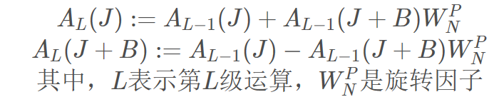
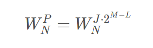

F为正弦信号频率，N为采样长，T为采样时间

### 实现原理：

1、先将原序列倒序。
 自然顺序数I加1，顺序表的二进制数的最低位加1，逢二向高位进位；而倒序数是在M位二进制数的最高位加1，逢2向低位进位。
 2、蝶形运算
 定义：2点DFT运算称为蝶形运算
 设序列x(n)经过倒序后，如果两个输入数据相距B个点，则：

3、旋转因子的变化规律

其中，
 L：从左到右的运算级数
 N：总共运算的DFT点数，N=2^M
 J=0,1,…,2^{L-1}-11

